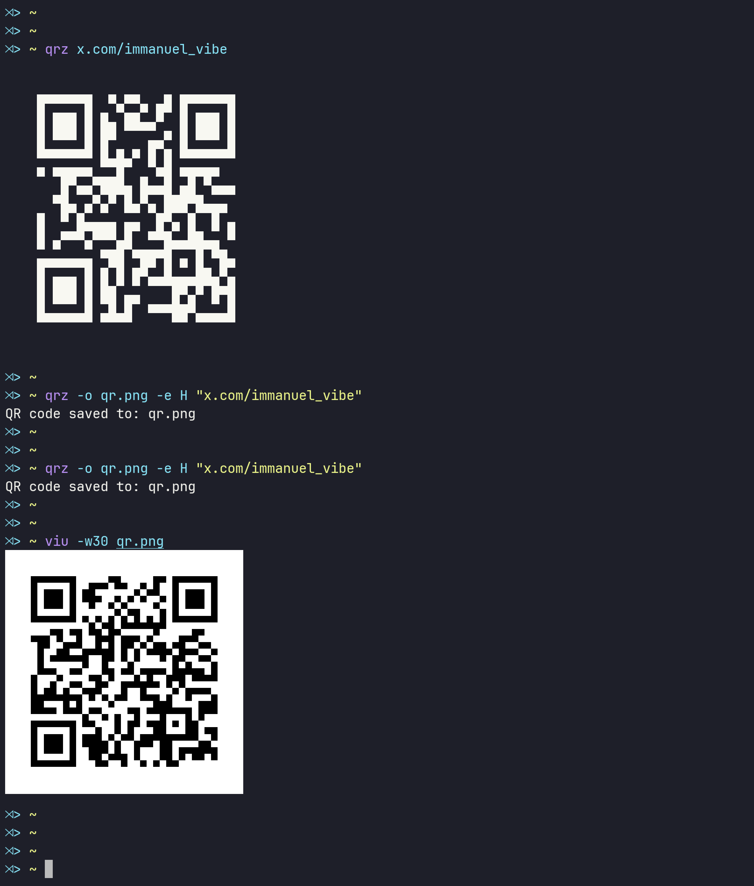

# qrz - QR code generator CLI tool

```bash
USAGE:
    qrz [OPTIONS] <data>


GENERATE OPTIONS:
    <data>                      Data to encode (required unless -i is used)
    -i, --input <file>          Read data from file ("-" for stdin)
    -o, --output <file>         Output file (default: stdout/terminal)
    -t, --type <format>         Output format: png, txt, ansi, svg (default: png)
    -e, --error <level>         Error correction: L, M, Q, H (default: M)
    -s, --size <n>              Module size in pixels (default: 10)
    -m, --margin <n>            Quiet zone margin in modules (default: 4)
    --terminal                  Force terminal output
    -h, --help                  Show this help message

ERROR CORRECTION LEVELS:
    L    Low     - 7% recovery
    M    Medium  - 15% recovery (default)
    Q    Quartile - 25% recovery
    H    High    - 30% recovery

EXAMPLES:
    qrz "any text"
    qrz -o qr.png -e H "https://example.com"
    qrz -t txt -m 2 "1234567890"
    qrz -i data.txt -o qr.svg -t svg
    qrz -o qr.png -e H "https://example.com"
```


